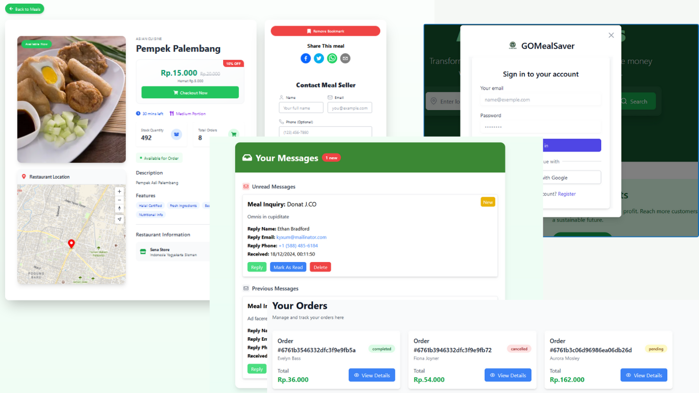

<h1 align="center">GoMealSaver</h1>

GoMealSaver is a web-based application for selling leftover / unsold food.

 

    

# Capstone Project Dicoding X Kampus Merdeka Batch 7

<h4> Kelompok: CS7-F004 </h4>
<h4> Tema: Green Economy dan Green Jobs. </h4>
<h4> Nama Aplikasi: GoMealSaver </h4>

 Durasi Pengerjaan Projek: 19 November 2024 - 19 November 2024 

### Latar Belakang:
Latar belakang dari proyek ini berangkat dari tingginya tingkat food wasteglobal yang mencapai 931 juta ton setiap tahunnya, padahal sebagian besarmakanan tersebut masih bisa dikonsumsi. Penjual seringkali tidak memiliki saluranuntuk menjual makanan sisa mereka, sementara banyak konsumen yangsebenarnya berminat untuk membelinya dengan harga lebih murah. Kami memilihproyek ini karena percaya bahwa platform digital dapat menjadi solusi untukmasalah food waste dengan menghubungkan konsumen dan penjual secaralangsung.
Website ini diharapkan dapat menjadi "painkiller" dengan memberikanmanfaat nyata kepada para penjual dalam mengurangi food waste sekaligusmemberikan keuntungan finansial dan lingkungan. Bagi konsumen, platform inimenawarkan akses ke makanan yang lebih terjangkau, sehingga dapatberkontribusi dalam mengurangi dampak food waste secara kolektif. Kamimengadopsi metode design thinking untuk memastikan bahwa platform iniberorientasi pada kebutuhan pengguna dan memberikan dampak yang maksimal.

## Fitur Pada GoMealSaver

Berikut adalah beberapa fitur terkini yang dimiliki GoMealSaver:

- [x] Autentikasi pengguna dengan Google & Next Auth
- [x] Registrasi Akun 
- [x] ke amanan recaptcha 
- [x] Otorisasi pengguna
- [x] Perlindungan rute
- [x] Profil pengguna dengan daftar pengguna
- [x] Daftar makanan CRUD
- [x] Unggahan gambar makanan 
- [x] Pencarian makanan
- [x] Pesan internal dengan notifikasi 'belum dibaca'
- [x] Order Makanan (User)
- [x] Bukti Trankaksi (Pemilik / penjual)
- [x] Prosess  / Batalkan pesanan (pemilik / penjual)
- [x] Halaman About
- [x] Galeri gambar dengan penghapusan foto
- [x] Peta kotak peta
- [x] Penandaan makanan / makanan yang disimpan
- [x] Berbagi makanan ke media sosial
- [x] Desain responsif (Tailwind)
- [x] Halaman 404 khusus
- [x] Next.js Action

## GoMealSaver menggunakan teknologi berikut:

- [Next.js](https://nextjs.org/)
- [React](https://reactjs.org/)
- [Tailwind CSS](https://tailwindcss.com/)
- [MongoDB](https://www.mongodb.com/)
- [Mongoose](https://mongoosejs.com/)
- [NextAuth.js](https://next-auth.js.org/)
- [React Icons](https://react-icons.github.io/react-icons/)
- [Cloudinary](https://cloudinary.com/)
- [Mapbox](https://www.mapbox.com/)
- [OpenCage](https://opencagedata.com/)
- [Maptiler](https://www.maptiler.com/)
- [React Spinners](https://www.npmjs.com/package/react-spinners)
- [React Toastify](https://fkhadra.github.io/react-toastify/)
- [React Share](https://www.npmjs.com/package/react-share)
- [reCAPTCHA](https://www.google.com/recaptcha/about/)
- [bcryptjs](https://www.npmjs.com/package/bcryptjs)
- [framer-motion](https://motion.dev/)
- [typed.js](https://mattboldt.com/demos/typed-js/)

## License

This project is licensed under the MIT License - see the [LICENSE.md](LICENSE.md) file for details
